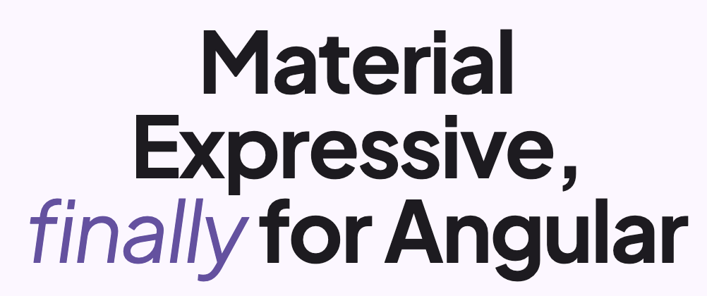

# Mat Expressive

<p align="center">
<a href="https://expressive.angular-material.dev" target="_blank" rel="noopener noreferrer">
  
</a>
</p>

Mat Expressive is a library of components and styles for Angular Material, built on the latest Material Design 3 Expressive Design System.

It is **not** a replacement for Angular Material and **not** a fork of it. Instead, it's a collection of:

| Kind | What it does |
| --- | --- |
| **Styles** | Applied to existing Angular Material components to make them expressive and consistent with M3 Expressive. |
| **Directives** | Same goal as styles, but used when styles need to reach the underlying HTML elements or add specific behavior. |
| **Components** | New components for cases Angular Material doesn't cover. |

## Getting started

```bash
ng add @ngm-dev/mat-exp
```

See the [installation guide](https://expressive.angular-material.dev/docs/getting-started/installation) for setup instructions, or browse the [full documentation](https://expressive.angular-material.dev/docs) for components, styling APIs, and playgrounds.

## How does it work?

Mat Expressive styles components using Angular Material's [`overrides` APIs](https://material.angular.dev/guide/theming#component-tokens) and [CSS variables](https://material.angular.dev/guide/theming-your-components). When a change isn't possible through those APIs, Mat Expressive applies styles directly to the underlying HTML elements instead (for example, Angular Material's `.mdc-button` class).

> [!NOTE]
> Applying styles directly to underlying HTML elements means Mat Expressive could break if Angular Material changes those classes in a future release. We track Angular Material releases and update accordingly when that happens.

Don't want styles applied to underlying HTML elements? You can opt out — see [Skip HTML element styles](https://expressive.angular-material.dev/docs/styles-api/reducing-css-payload#skip-html-element-styles) in the Styles API section. Note that some visual results (like icon sizing and shape morphing) won't be available without them.

## Licensing

`@ngm-dev/mat-exp` is free and open source under the [MIT](./LICENSE) license.

Questions? Contact [support@angular-material.dev](mailto:support@angular-material.dev).

## Contributors ✨

Thanks goes to these wonderful people ([emoji key](https://allcontributors.org/docs/en/emoji-key)):

<!-- ALL-CONTRIBUTORS-LIST:START - Do not remove or modify this section -->
<!-- prettier-ignore-start -->
<!-- markdownlint-disable -->
<table>
  <tbody>
    <tr>
      <td align="center" valign="top" width="14.28%"><a href="https://github.com/shhdharmen"><br /><sub><b>Dharmen Shah</b></sub></a><br /><a href="https://github.com/ngxpert/hot-toast/commits?author=shhdharmen" title="Code">💻</a> <a href="#content-shhdharmen" title="Content">🖋</a> <a href="#design-shhdharmen" title="Design">🎨</a> <a href="https://github.com/ngxpert/hot-toast/commits?author=shhdharmen" title="Documentation">📖</a> <a href="#example-shhdharmen" title="Examples">💡</a></td>
    </tr>
  </tbody>
</table>
<!-- markdownlint-restore -->
<!-- prettier-ignore-end -->
<!-- ALL-CONTRIBUTORS-LIST:END -->

This project follows the [all-contributors](https://github.com/all-contributors/all-contributors) specification. Contributions of any kind welcome!