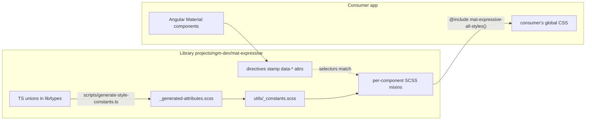
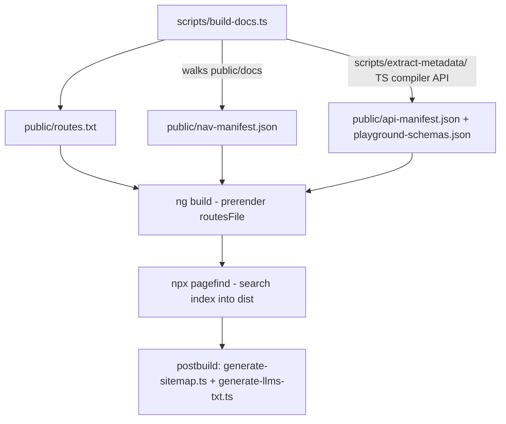

# ARCHITECTURE.md — How mat-expressive Actually Works

> Audience: an AI model (or human) with zero prior context maintaining this repo.
> Every claim below was verified against the code on `feature/revamped-docs` (commit `05966f0`).
> When this doc and the code disagree, trust the code and update this doc.

## 1. The one-paragraph mental model

`@ngm-dev/mat-expressive` does **not** fork or wrap Angular Material. It decorates Angular
Material's own components with **attribute directives** that stamp `data-*` attributes onto the
host element, and ships **global SCSS mixins** whose selectors key off those attributes
(`.mat-expressive-button[data-size='m']`). The SCSS sets Angular Material's official theming
tokens via `mat.button-overrides(...)` where possible, and falls back to raw CSS on Material's
internal `.mdc-*` classes where the token API can't reach. One component
(`MatExpressiveLoadingIndicator`) is a genuinely new component with GSAP-driven animation.
The docs site is a second Angular app in the same workspace: a custom static-site generator
built on markdown files + Angular prerendering (ng-doc was removed — see ADR at
`docs/adr/`, and note the checked-in `CLAUDE.md` still describes the old ng-doc setup; it is stale).

## 2. Workspace layout

```
mat-expressive/
├── projects/ngm-dev/mat-expressive/   # THE LIBRARY (published npm package)
│   └── src/
│       ├── public-api.ts              # entry point: re-exports lib/components + lib/types
│       └── lib/
│           ├── components/
│           │   ├── all-buttons/       # the "Button Family" (see §4)
│           │   └── loading-and-progress/loading-indicator/
│           ├── types/                 # string-literal union types (size, shape, …)
│           ├── utils/di/create-options.ts   # options-bag DI factory
│           ├── styles/                # global SCSS mixin system (see §5)
│           ├── constants/version.ts
│           └── assets/shapes/*.svg    # UNUSED at runtime (path data is inlined
│                                      # in loading-indicator.shapes.ts); reference only
├── src/                               # THE DOCS APP (mat-expressive-docs)
├── public/docs/                       # markdown content, served as static assets (ADR 0002)
├── scripts/                           # build-docs.ts + extract-metadata/ + generators
├── e2e/                               # Playwright specs for the DOCS SITE (13 files, ~298 tests)
├── docs/adr/                          # 6 architecture decision records — READ THESE
└── temp/navigation-rail/              # dead code copied from another repo (ngm-dev-blocks);
                                       # does not compile here (imports missing utils/cx)
```

Two Angular projects, one workspace (`angular.json`):

- `@ngm-dev/mat-expressive` — built by ng-packagr (`projects/ngm-dev/mat-expressive/ng-package.json`).
- `mat-expressive-docs` — built by `@angular/build:application` with
  `prerender.routesFile: public/routes.txt` and `ssr: false` (SSG only, no runtime SSR server).



## 3. The library's public API surface

Everything exported from `projects/ngm-dev/mat-expressive/src/public-api.ts` →
`lib/components/index.ts` + `lib/types/index.ts`:

| Export | Kind | Attaches to | File |
|---|---|---|---|
| `MatExpressiveButton` | Directive `[matExpressiveButton]` | `MatButton` host | `lib/components/all-buttons/button/button.ts` |
| `MatExpressiveIconButton` | Directive `[matExpressiveIconButton]` | `MatIconButton` host | `.../icon-button/icon-button.ts` |
| `MatExpressiveButtonGroup` | Component `<mat-expressive-button-group>`, implements `ControlValueAccessor` | — | `.../button-group/button-group.ts` |
| `MatExpressiveSplitButton` | Component `<mat-expressive-split-button>` | — | `.../split-button/split-button.ts` |
| `MatExpressiveFabMenu` | Directive `[matExpressiveFabMenu]` | `MatMenu` | `.../fab-menu/fab-menu.ts` |
| `MatExpressiveFabMenuTrigger` | Directive `[matExpressiveFabMenuTrigger]` | `MatMenuTrigger` host | `.../fab-menu/fab-menu-trigger.ts` |
| `MatExpressiveLoadingIndicator` | Component `<mat-expressive-loading-indicator>` | — | `lib/components/loading-and-progress/loading-indicator/loading-indicator.ts` |
| `MatExpressiveSelectableButton(Change)` | interface + event class | — | `.../selectable-button/selectable-button.ts` |
| `ButtonGroupChild`, adapters, `bindButtonGroupChildren` | interface + helpers | — | `.../button-group-child/button-group-child.ts` |
| `provideMatExpressive*Options` / `MAT_EXPRESSIVE_*_OPTIONS` | DI | — | each `*.options.ts` |
| `MatExpressiveButtonSize/Shape/State/Toggle/…` | string-literal unions | — | `lib/types/*.ts` |

**Private API convention:** anything prefixed `_` or JSDoc-tagged `@internal` is private.
`@internal` inputs are also excluded from the docs Playground schema by
`scripts/extract-metadata/` — so the tag has build-pipeline meaning, not just documentation meaning.

### The options-bag DI pattern (used by every configurable component)

`lib/utils/di/create-options.ts` — `matExpressiveCreateOptions(defaults)` returns
`{ token, provide, inject }`. Each `*.options.ts` file calls it once and re-exports the three
under component-specific names. `provide()` merges partial overrides on top of whatever is
provided further up the injector tree. Component code reads defaults via
`injectMatExpressive<X>Options()` in field initializers, e.g.
`public readonly size = model(this._options.size)` (`button.ts:29`).
**When adding a component, copy this pattern exactly** — see COMPONENT-FACTORY.md.

### How child broadcast works (ButtonGroup / SplitButton → projected buttons)

`button-group-child.ts` defines a narrow `ButtonGroupChild` interface
(`setSize/setShape/setAppearance/setDisabled`), adapter classes for the two button directives,
and `bindButtonGroupChildren(config)` which registers `effect()`s that push group-level inputs
down to projected children. Both `MatExpressiveButtonGroup` (`button-group.ts:159`) and
`MatExpressiveSplitButton` (`split-button.ts:62`) call it in their constructors. This is the
*only* sanctioned way for a container to control child buttons.

## 4. The Button Family and its style mechanism (the core invariant)

Read `docs/adr/0006-button-family-style-mechanism.md` in full before touching any button styling.
Summary of the invariant:

- Six members (`button`, `icon-button`, `button-group`, `split-button`, `fab-menu`,
  `fab-menu-trigger`) share one combinatorial token system and **must render pixel-identical
  wherever a value overlaps** (a `size='m'` button alone must equal a `size='m'` button inside
  a group).
- Four members are Directives → no `styleUrls` possible → global SCSS mixins are the only
  styling surface. The two Components (`button-group`, `split-button`) *deliberately* stay on the
  same global-mixin path to avoid forking the token system. Do not "fix" this by giving them
  component-scoped styles.
- `loading-indicator` is NOT in the family: it uses ordinary `styleUrls` +
  `ViewEncapsulation.None` and continuous CSS custom properties
  (`--mat-expressive-loading-indicator-size` etc. in `loading-indicator.scss`). Zero consumer
  setup needed. Follow this model for any future non-family component.

**Decision rule for new components:** if the new component shares discrete size/shape/appearance
enums with the button family → global mixin path. If it stands alone → `styleUrls` +
`ViewEncapsulation.None` + CSS custom properties.

## 5. The SCSS token pipeline, end to end

Trace for `button` (identical shape for every family member):

1. **TS unions** — `lib/types/size.ts`, `shape.ts`, `state.ts`, `toggle.ts`, `width.ts`,
   `appearance.ts` define the allowed attribute values.
2. **Generation** — `scripts/generate-style-constants.ts` (run by `npm run
   generate:style-constants`, and automatically via the `prebuild:lib` hook) parses those unions
   with the TypeScript compiler API and writes
   `lib/styles/utils/_generated-attributes.scss` (`$generated-known-attributes`,
   `$generated-state-pseudo-map`). **Never hand-edit that file.**
3. **Constants** — `lib/styles/utils/_constants.scss` merges the generated map with
   hand-maintained attributes that have no TS union (`variant`, `selection`, `color`, `open`,
   `menu-open`) into `$known-attributes`.
4. **Tokens** — `lib/styles/components/all-buttons/button/tokens/_{xs,s,m,l,xl,common}.scss`
   hold the M3 Expressive spec values, expressed as Angular Material token names (e.g.
   `filled-container-height: functions.rem(32)`) plus raw `properties` maps for what tokens
   can't express (icon sizes, line-height on `.mdc-button__label`, …).
5. **Configs** — `configs/_{size}.scss` files list combination entries:
   `(size: 'xs', shape: 'square', state: 'pressed', tokens: …, properties: …)`.
   `_config.scss` joins them into one `$button-config` list.
6. **Mixin** — `button/_index.scss` `mat-expressive-button-styles($options)`:
   - validates the whole config against `$known-attributes` via
     `utils/functions/_validate-config.scss` (`@error` on any unknown key/value — this is the
     safety net that catches typos at build time);
   - iterates entries, string-builds a selector `.mat-expressive-button[data-size='xs']…`,
     emits `mat.button-overrides($tokens)` for the token slot, and raw properties via
     `utils/mixins/_apply-tokens-properties.scss` (skipped when the consumer passes
     `skip-html-element-styles: true`);
   - for `state` entries, emits BOTH `[data-state='pressed']` and the mapped pseudo-class
     (`:active`) variants (`_get-state-pseudo.scss`).
7. **Aggregation** — `components/all-buttons/_index.scss` exposes
   `mat-expressive-all-buttons-styles()`; `_mat-expressive-styles.scss` exposes
   `mat-expressive-all-styles()`; the package Sass entry `lib/styles/_index.scss` `@forward`s all
   of it.

Because the consumer's app compiles this SCSS, `@use '@angular/material' as mat` inside the
library SCSS resolves against the **consumer's** installed Angular Material — that is how token
names stay in sync with the consumer's Material version, and also why a Material-internal token
rename can break us silently (see §8).

**Cost of this design:** including `mat-expressive-all-styles()` emits ~153 KB of uncompressed
CSS (measured in a fresh app, see DX-AUDIT.md §3) because every combination is emitted flat.
Gzip reduces this heavily (repetitive selectors) but the number should be watched per release.

## 6. The docs site (mat-expressive-docs)

Language and terminology: `CONTEXT.md` at repo root is the authoritative glossary
(Doc Page, Section, Component Page, Build Script, API Manifest, Playground Schema, Routes File,
Doc Version, Version Branch, …). Use its terms in code and issues.

Pipeline (`npm run build:docs`):



Runtime app structure (`src/app/`):

- `shell/` — `DocsShellComponent` (header + sidebar + TOC, wraps `/docs/**`) and
  `StandaloneShellComponent` (landing `/`, `/pricing`, `/license`, static pages). Routing in
  `src/app/app.routes.ts`; section URLs redirect to first child via
  `shell/section-redirect.guard.ts` reading `sectionRedirects` from the nav manifest.
- `docs/doc-page/doc-page.component.ts` — fetches the page's `.md` from `public/docs/...` over
  HttpClient, renders via `shared/services/markdown.service.ts` (marked + marked-alert + Shiki
  highlighting). On `/playground` URLs it instead renders the component from
  `src/app/docs/playground-page-registry.ts` (URL → playground wrapper component).
- Playground: `shared/components/playground/playground.component.ts` renders controls
  auto-derived from `public/playground-schemas.json`; preview wrappers per component live in
  `shared/components/playground/previews/`; class-name → preview mapping in
  `shared/components/playground/playground-registry.ts`. **Two registries exist** — page-URL
  registry and class-name registry; a new component must be added to both.
- API reference: `docs/api-index-page/` + `docs/api-detail-page/` are data-driven from
  `public/api-manifest.json` (no markdown). URL scheme `/docs/api/:package/:kind/:symbol`.
- Search: `shell/search-modal/` calls Pagefind's JS API (ADR 0003). Ctrl/Cmd+K.
- Versioning: subdomain-per-major-version via Vercel branch deployments (ADR 0005),
  automated by `.github/workflows/version-snapshot.yml` on `v*.0.0` release events.
  `environment.version` empty string = "Latest"; non-empty bakes the deprecation banner.
- SEO: `@davidlj95/ngx-meta` per page + JSON-LD in `shared/utils/json-ld.ts`;
  `llms.txt` generated post-build.

**Critical wiring detail:** the docs app consumes the library styles **from source**
(`src/styles/_base.scss:2` → `@use '../../projects/ngm-dev/mat-expressive/src/lib/styles'`),
and library TS **from dist** (tsconfig path `@ngm-dev/mat-expressive → ./dist/ngm-dev/mat-expressive`,
so `npm run build:lib` must run before `npm start`). Because styles come from source, the docs
site can look perfect while the published npm package is broken — which is exactly what
happened (see ISSUES-TRIAGED.md #1). Any packaging change MUST be verified with `npm pack` +
a fresh external app, never via the docs site.

## 7. Build, release, deploy

- **Library build:** `npm run build:lib` = generate style constants → ng-packagr →
  copy root README into dist → `postbuild:lib` compiles `lib/styles/_index.scss` to
  `dist/.../src/styles/styles.css` with the Dart Sass CLI (`projects/ngm-dev/mat-expressive/package.json`
  `build:sass` script). NOTE: `_index.scss` contains only `@forward` statements, so this
  compiled CSS is **empty (41 bytes)** — see ISSUES-TRIAGED.md #1.
- **Release:** semantic-release from `main` pushes
  (`.github/workflows/test-build-publish.yaml`, config in `.releaserc.json`; publishes
  `dist/ngm-dev/mat-expressive`, angular commit preset, maintenance branches `N.x.x` supported).
  The e2e job runs Playwright against the docs app; the publish job runs lint + builds.
  **Unit tests (`npm test`) are not run anywhere in CI.**
- **Deploy:** Vercel builds `npm run build:lib && npm run build:docs` (`vercel.json`).
  A second, older workflow `.github/workflows/deploy.yaml` still deploys to GitHub Pages on
  every main push using plain `npm run build` (no nav-manifest/pagefind regeneration) — it is a
  leftover and should be deleted (ISSUES-TRIAGED.md #9).
- **Version snapshot:** `.github/workflows/version-snapshot.yml` (see §6).

## 8. Invariants that must never break

1. **SSR/SSG safety.** Library code must not touch `window`/`document` outside
   `isPlatformBrowser` guards. `loading-indicator.ts:131-153` is the reference: constructor
   returns early on server; GSAP work happens in `afterRenderEffect`; `animate.enter/leave`
   short-circuit via `event.animationComplete()`. The docs site prerenders 117 routes — any
   unguarded browser API in a component used by a prerendered page breaks `npm run build:docs`.
2. **The TS ↔ SCSS attribute contract.** Attribute values exist in three places: TS unions,
   generated SCSS whitelist, and the `data-*` host bindings. The generator + `validate-config`
   keep the first two in sync. If you add a union member, run
   `npm run generate:style-constants` and add token/config entries, or the Sass build errors.
   Never hand-edit `_generated-attributes.scss`.
3. **Angular Material private-class dependency.** The `properties:` maps intentionally style
   `.mdc-button__label`, `.mat-icon`, etc. (`styles/components/all-buttons/_common-selectors.scss`).
   This is a knowing bet (documented in `public/docs/getting-started/what-is-mat-expressive/index.md`).
   Every Angular Material **minor** bump must be followed by a visual pass of every component
   in the docs playground. Peer range is `^21.1.0` (`projects/ngm-dev/mat-expressive/package.json`)
   — do not widen it to a new major without that visual pass.
4. **Tree-shaking / side effects.** The lib package.json has `"sideEffects": false`.
   Never add module-level side effects (top-level GSAP registration, global CSS imports) to
   library TS. GSAP plugin registration must stay inside `registerGsapPluginsOnce()` called
   from component constructors.
5. **Pixel-identity across the Button Family** (§4). Change a token value in ONE size file for
   ONE component and you must check the same value for the other family members that share it.
6. **`@internal` means invisible.** The docs pipeline (`scripts/extract-metadata/`) omits
   `@internal` inputs from playground controls and API pages. Removing the tag exposes the
   member publicly in docs.

## 9. Here be dragons

- **Packaging is the #1 dragon.** The npm package as published (v1.0.1) and as produced by
  `npm run build:lib` on this branch contains **no SCSS files and an empty styles.css** —
  the documented install path fails for every npm consumer. The `exports` field in
  `projects/ngm-dev/mat-expressive/package.json` points `"sass"` at `./src/lib/styles/_index.scss`,
  which is never copied into dist; `ng-package.json`'s `assets: ["src/lib/assets/**/*"]` globs a
  directory that does not exist. Fix + verification recipe in ISSUES-TRIAGED.md #1.
- **`fab-menu.ts` panelClass accumulation.** Both an `afterNextRender` and an `effect` append
  to `matMenu.panelClass` by joining with the *previous* `panelClass` (`fab-menu.ts:18-38`).
  The classes are applied twice at startup, and each `color` change appends another copy —
  the old color class is never removed. Menu panel classes grow forever. Fix by computing the
  full class list from scratch each time (keep the consumer's original classes captured once).
- **Non-signal `@Input` getters bound in `host`.** `icon-button.ts:38-44` (`appearance`) and
  the `isMenuOpen` getters (`button.ts:67`, `icon-button.ts:71`, `fab-menu-trigger.ts:24`)
  are plain getters bound to `[attr.data-*]`. They only refresh when the host component's CD
  runs — fine under zoneless+signals today because Material's own state changes trigger CD,
  but fragile. Migrate to signals when touched.
- **State pseudo-selectors are duplicated on purpose.** Both `[data-state='pressed']` and
  `:active` selector variants are emitted (§5 step 6). Don't "deduplicate" — the data-attribute
  variant exists so docs/demos can force states.
- **`$known-attributes` contains `select-required`** (`utils/_constants.scss:33`) but the TS
  union `MatExpressiveButtonGroupSelection` has it commented out (`types/selection.ts`).
  The SCSS whitelist is deliberately permissive there; if you implement `select-required`,
  uncomment the TS side.
- **Stale test doubles.** `src/app/shell/section-redirect.guard.spec.ts` fails (2 tests) because
  its mock `RouterStateSnapshot` no longer matches what the guard reads. CI never runs unit
  tests, so this rot is invisible — run `npm test` locally before trusting a green CI.
- **Two changelogs.** `CHANGELOG.md` (semantic-release-managed) and `public/changelog/index.md`
  (docs-site page) are separate files with no sync mechanism.
- **`temp/navigation-rail/`** is not part of this codebase (copied from ngm-dev-blocks,
  doesn't compile). Don't import from it; delete or move when a real navigation-rail component
  is started.
- **`CLAUDE.md` is stale** on this branch (describes the removed ng-doc setup, wrong test copy).
  Update it when this branch merges — until then prefer this document set.
